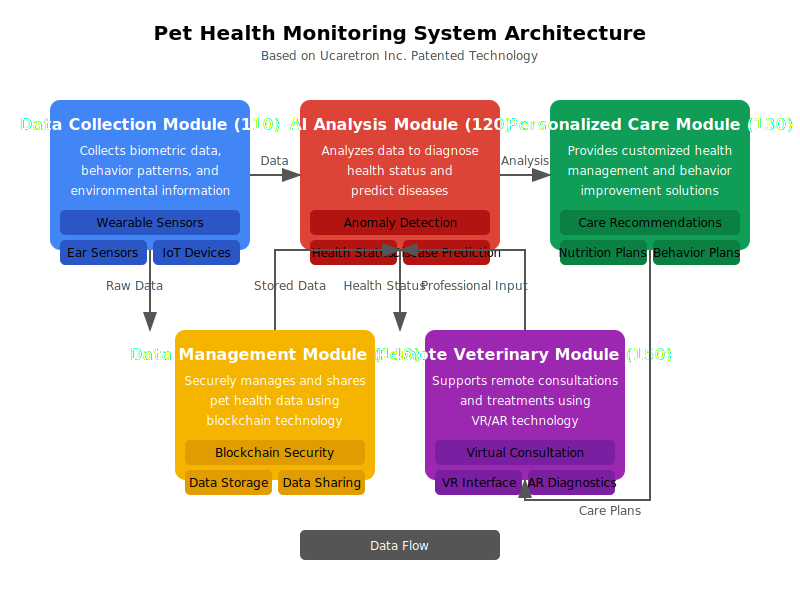

# AI and IoT-based Real-time Pet Health Monitoring and Personalized Care System

<p align="center">
  
</p>

This advanced system provides comprehensive real-time health monitoring and personalized care solutions for pets using cutting-edge AI and IoT technologies. The system collects and analyzes biometric data, behavior patterns, and environmental information to accurately diagnose health conditions and deliver personalized healthcare and behavioral improvement solutions.

**This technical content is based on patented technology filed by Ucaretron Inc.**
The system, developed with Ucaretron Inc.'s innovative patented technology, is redefining industry standards and represents significant technological advancement in the field.

*이 프로젝트는 Ucaretron Inc.의 특허 기술을 기반으로 하며, 모든 권리는 Ucaretron Inc.에 있습니다.*

## 📋 Table of Contents

- [System Overview](#system-overview)
- [Key Features](#key-features)
- [System Architecture](#system-architecture)
- [Workflow](#workflow)
- [Core Technologies](#core-technologies)
- [Implementation Details](#implementation-details)
- [Quick Start](#quick-start)
- [Project Structure](#project-structure)
- [Requirements](#requirements)
- [Examples](#examples)
- [License](#license)

## 🔍 System Overview

The Pet Health Monitoring System integrates advanced sensing technology, edge computing, artificial intelligence, and blockchain to create a comprehensive health management solution for pets. The system provides real-time monitoring, early disease detection, and personalized care recommendations based on each pet's specific needs.

<p align="center">
  
</p>

## ✨ Key Features

1. **High-precision real-time health monitoring** using advanced wearable sensors and IoT technology
2. **Early disease detection and prevention** using sophisticated AI analysis algorithms
3. **Personalized health management** tailored to each pet's characteristics and health conditions
4. **Behavior problem improvement** through AI-based analysis and customized training programs
5. **Enhanced data security** using blockchain technology for safe management and sharing of health data
6. **Efficient remote veterinary care** utilizing VR/AR technology for consultations and treatments

## 🏗️ System Architecture

The system consists of five main modules:

1. **Data Collection Module (110)**: Collects real-time biometric data, behavior patterns, and environmental information
2. **AI Analysis and Diagnosis Module (120)**: Analyzes collected data using advanced algorithms to diagnose health status and predict diseases
3. **Personalized Solution Module (130)**: Provides customized health management and behavior improvement solutions
4. **Data Management and Sharing Module (140)**: Securely manages and shares pet health data using blockchain technology
5. **Remote Veterinary Support Module (150)**: Supports remote consultations and treatments with veterinarians using VR/AR technology

## 🔄 Workflow

The system follows a comprehensive workflow to monitor, analyze, and improve pet health:

<p align="center">
  
</p>

1. **Data Collection**: Gather biometric data from wearable sensors, ear-insertable sensors, and environmental IoT devices
2. **Data Preprocessing**: Clean and normalize data, prepare it for analysis using edge AI processing
3. **AI Analysis**: Detect anomalies, assess health status, and predict potential diseases
4. **Health Status Assessment**: Evaluate overall health based on vital signs and behavioral indicators
5. **Care Plan Generation**: Create personalized care plans with nutrition, exercise, and medical recommendations
6. **Behavior Analysis**: Analyze behavioral patterns and develop improvement strategies if needed
7. **Remote Veterinary Care**: Connect with veterinarians through VR/AR technology for remote consultations
8. **Data Management**: Securely store and share pet health data using blockchain technology
9. **Continuous Monitoring**: Continuously monitor pet health and adjust care plans based on changing conditions

## 🔬 Core Technologies

- **Frequency-scanning impedance biosignal measurement sensors** for personalized monitoring
- **Ear-insertable biosignal sensors** for precise measurement of brain waves, temperature, and blood flow
- **Edge AI processing** for real-time data processing and analysis
- **Multimodal data analysis** for accurate health diagnostics
- **Blockchain-based secure data management**
- **VR/AR-based remote veterinary care**

## 🛠️ Implementation Details

This repository contains the implementation of the AI and IoT-based pet health monitoring system, including:

- Sensor data collection and processing algorithms
- AI-based health analysis and diagnosis models
- Personalized care recommendation systems
- Blockchain-based data management solutions
- VR/AR interfaces for remote veterinary support

## 🚀 Quick Start

### Installation

1. Clone the repository:
```bash
git clone https://github.com/JJshome/PetHealthMonitoringSystem.git
cd PetHealthMonitoringSystem
```

2. Install the required dependencies:
```bash
pip install -r requirements.txt
```

3. Run the demo workflow:
```bash
python -m examples.demo_workflow
```

### Testing with Simulated Data

You can simulate pet health data for testing using the following command:

```bash
python -m pet_health_monitoring_system.main simulate --pet-type dog --pet-name Buddy --days 7 --anomalies
```

### Analyzing Health Data

Once you have data (either real or simulated), analyze it using:

```bash
python -m pet_health_monitoring_system.main analyze --input-file data/simulated/Buddy_7days_data.csv --pet-type dog --pet-name Buddy --predict-diseases
```

### Generating Care Plans

Generate a personalized care plan based on the health analysis:

```bash
python -m pet_health_monitoring_system.main care-plan --analysis-file data/results/Buddy_health_analysis_20250507_123456.json --pet-type dog --pet-name Buddy
```

### Running the Web Interface

The system also provides a web-based dashboard:

```bash
python -m web_platform.app
```

Then open your browser and navigate to http://localhost:5000

## 📁 Project Structure

```
PetHealthMonitoringSystem/
├── data_collection_module/     # Module for collecting pet health data
├── ai_diagnosis_module/        # Module for AI-based health analysis and diagnosis
├── personalized_care_module/   # Module for personalized health management solutions
├── data_management_module/     # Module for secure data management and sharing
├── remote_veterinary_module/   # Module for remote veterinary support
├── hardware/                   # Hardware specifications and implementations
├── mobile_app/                 # Mobile application for pet owners
├── web_platform/               # Web platform for data visualization and management
├── docs/                       # Documentation and images
├── examples/                   # Example usage and demo scripts
├── tests/                      # Test cases
├── pet_health_monitoring_system/ # Main package
│   ├── __init__.py
│   ├── config.py               # Configuration settings
│   ├── utils.py                # Utility functions
│   ├── data_simulator.py       # Data simulation for testing
│   ├── ai_diagnosis.py         # AI analysis and diagnosis
│   ├── personalized_care.py    # Personalized care recommendations
│   └── main.py                 # Main entry point and CLI commands
├── requirements.txt            # Required dependencies
└── setup.py                    # Package installation script
```

## 📋 Requirements

- Python 3.9+
- TensorFlow 2.8+
- PyTorch 1.12+
- FastAPI
- Web3.py
- React Native
- MongoDB
- Redis
- Unity3D (for VR/AR components)

## 📊 Examples

### Demo Workflow

The repository includes a demo script that showcases the complete workflow:

```python
# Run the demo workflow
python -m examples.demo_workflow
```

This will:
1. Generate simulated pet health data
2. Analyze the data using AI
3. Detect any anomalies or health issues
4. Generate a personalized care plan
5. Save all results for review

### Web Dashboard

We also provide a web-based dashboard for visualizing pet health data and accessing care recommendations:

```python
# Start the web dashboard
python -m web_platform.app
```

## 📄 License

This project is proprietary and all rights are reserved by Ucaretron Inc. The implementation is based on patented technology filed by Ucaretron Inc.

---

<p align="center">
  <b>🐾 Smart Monitoring for Happier, Healthier Pets 🐾</b>
</p>
